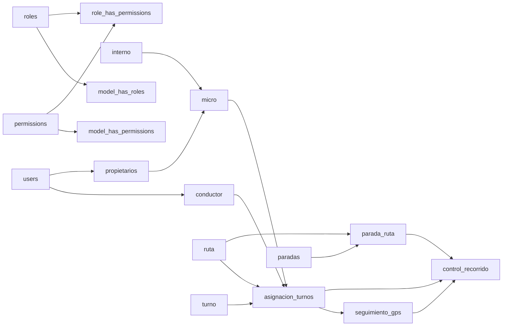

# Auditoría de Inconsistencias (BD ↔ Modelos ↔ Spec) — Línea 61 / FICHA2026

**Rol asumido:** DBA + Arquitecto de software + Dev mid
**Fuentes analizadas:**
- `devsolutions_benjaminvillegasrojas.sql` (dump real de la BD, MySQL/InnoDB)
- `linea57_control/` (repo Laravel 11: `database/migrations/*`, `app/Models/*`)
- `DECISIONES_Y_REVISION_SDD.md` (spec/decisiones ya existentes en el repo)
**Metodología:** Spec-Driven Development (SDD) — cada hallazgo se documenta como
**Contrato roto → Especificación correcta → Criterios de aceptación → Tareas → Test de regresión**,
para que cada fix sea verificable y no dependa de memoria/tribal knowledge.

---

## 1. Resumen ejecutivo

| # | Hallazgo | Severidad | Tipo |
|---|---|---|---|
| 1 | `Ruta::turnos()` referencia `turno.ruta_id`, columna eliminada por migración | 🔴 Crítica | Bug real (rompe en runtime) |
| 2 | Normalización de usuarios incompleta (`user_id` nulo en 100% de conductores/propietarios) | 🟠 Alta | Spec vs. dato real |
| 3 | Dependencia en diamante `control_recorrido` → `asignacion_turno_id` (loop lógico) | ✅ Resuelto | Desacoplado: derivado vía `seguimiento_gps` y `parada_ruta` |
| 4 | Tabla `admin` huérfana (sin columnas, sin FK, sin modelo, sin uso) | 🟡 Media | Deuda de esquema |
| 5 | `fiscalizadors` sin relación en el grafo (entidad de dominio aislada) | 🟡 Media | Spec incompleta |
| 6 | Convención de nombres de tabla mixta (singular/plural) | 🟢 Baja | Estilo / mantenibilidad |
| 7 | Riesgo latente de recursión infinita en serialización (`$with` circular) | 🟢 Baja (preventivo) | Guardrail faltante |

**Respuesta directa a "¿hay loops en la BD?":** No, a nivel de restricciones `FOREIGN KEY` el esquema **es un DAG** (grafo acíclico dirigido) — lo verifiqué recorriendo las 17 FKs del dump, ver §2. Lo que sí existe es un **loop lógico** (dependencia funcional redundante, hallazgo #3) y una relación de código que apunta a un contrato que ya no existe (hallazgo #1), que es más peligroso que un ciclo de FK porque el motor de BD no lo detecta — solo explota en tiempo de ejecución.

---

## 2. Verificación de ciclos — Grafo de Foreign Keys



**Orden topológico válido encontrado:**
`users → {conductor, propietarios} → interno → micro → {ruta, turno, paradas} → parada_ruta → asignacion_turnos → seguimiento_gps → control_recorrido`

Ningún nodo se referencia a sí mismo transitivamente ⇒ **no hay ciclo de FK**. Confirmado además porque el dump no falla al importarse con `FOREIGN_KEY_CHECKS=1` en el orden en que aparece.

> Nota histórica positiva: la migración `2026_08_14_231303_remove_interno_id_from_asignacion_turnos_table.php` eliminó una FK directa `asignacion_turnos.interno_id → interno` que convivía con el camino indirecto `asignacion_turnos → micro → interno`. Eso **sí era un patrón de diamante peligroso** (dos caminos para llegar al mismo dato, sin garantía de que coincidieran) y fue corregido correctamente. Ese mismo patrón reaparece, sin corregir, en el hallazgo #3.

---

## 3. Inconsistencias detectadas

### 🔴 #1 — `Ruta::turnos()` apunta a una columna que ya no existe (bug activo)

**Evidencia:**
- Migración `2026_08_13_000001_refactor_turno_table.php` (comentario textual del propio autor):
  > *"Refactoriza la tabla `turno` para que sea un catálogo estático de horarios. Elimina: fiscalizador_id, interno_id, **ruta_id**..."*
- Dump real (`CREATE TABLE turno`): columnas `id, nombre, hora_inicio, hora_fin, descripcion, estado, created_at, updated_at` → **no tiene `ruta_id`**.
- `app/Models/Ruta.php`:
  ```php
  public function turnos()
  {
      return $this->hasMany(\App\Models\Turno::class, 'ruta_id', 'id');
  }
  ```

**Contrato roto:** el modelo promete `Ruta` 1→N `Turno` por columna directa; la BD dice que `turno` es un catálogo independiente (mañana/tarde/noche) y que la relación real Ruta↔Turno solo existe *indirectamente*, a través de `asignacion_turnos`.

**Especificación correcta (SDD):**
```markdown
### Spec: Relación Ruta ↔ Turno
CONTEXTO: `turno` es un catálogo estático (mañana/tarde/noche), no depende de `ruta`.
La relación real entre una ruta y los turnos que efectivamente cubre
pasa siempre por `asignacion_turnos` (turno_id + ruta_id + fecha).

DADO un objeto Ruta
CUANDO se solicitan "los turnos vinculados a esta ruta"
ENTONCES debe interpretarse como "turnos con al menos una asignación histórica/activa en esta ruta"
Y debe resolverse vía `asignacion_turnos`, no vía columna directa.
```

**Criterios de aceptación:**
- [ ] `Ruta::turnos()` no ejecuta SQL contra una columna inexistente.
- [ ] Existe un método con nombre inequívoco (`turnosAsignados()` o similar) que documente que es derivado, no una FK directa.
- [ ] Ningún test/feature llama al método viejo esperando el comportamiento anterior.

**Tareas:**
1. Eliminar o renombrar `Ruta::turnos()`.
2. Reemplazar por relación derivada:
   ```php
   public function turnosAsignados()
   {
       return $this->hasManyThrough(
           Turno::class,
           AsignacionTurno::class,
           'ruta_id',   // FK en asignacion_turnos hacia ruta
           'id',        // PK en turno
           'id',        // PK en ruta
           'turno_id'   // FK en asignacion_turnos hacia turno
       )->distinct();
   }
   ```
3. Buscar todos los usos de `->turnos` sobre instancias de `Ruta` en controllers/vistas/tests (`grep -rn "->turnos\b" app resources tests`) y migrarlos.

**Test de regresión (PHPUnit, sugerido):**
```php
public function test_ruta_turnos_relacion_no_falla_y_es_correcta(): void
{
    $ruta = Ruta::factory()->create();
    $turno = Turno::factory()->create();
    AsignacionTurno::factory()->create(['ruta_id' => $ruta->id, 'turno_id' => $turno->id, /* ... */]);

    $this->assertTrue($ruta->turnosAsignados->contains($turno));
}
```

---

### 🟠 #2 — Normalización de usuarios declarada pero no aplicada

**Evidencia:**
- `DECISIONES_Y_REVISION_SDD.md` §2.3:
  > *"la tabla `users` es la fuente única de verdad... `conductor` conserva el vínculo **obligatorio** `user_id`"*
- Dump real: `conductor.user_id bigint unsigned DEFAULT NULL` (nullable, no `NOT NULL`).
- Datos reales: los 5 registros de `conductor` tienen `user_id = NULL`; lo mismo aplica a `propietarios`. La tabla `users` solo tiene 2 filas (`admin@example.com`, `test@example.com`), ninguna vinculada a un conductor o propietario real.
- `Conductor.php` / `Propietario.php` tienen accessors (`getNombreAttribute`, etc.) que hacen fallback a la columna local cuando `user` es `null` — es decir, **el código ya asume que el vínculo puede faltar**, contradiciendo la palabra "obligatorio" del documento de decisiones.

**Contrato roto:** el spec dice "vínculo obligatorio + users como fuente única de verdad"; la BD permite (y de hecho contiene) datos duplicados y desincronizados entre `conductor`/`propietarios` y `users`.

**Especificación correcta:**
```markdown
### Spec: Vínculo Conductor/Propietario ↔ User
DADO que `users` es la fuente única de verdad para datos personales
CUANDO se crea un Conductor o Propietario operativo
ENTONCES `user_id` DEBE poblarse en el mismo flujo transaccional (no puede quedar NULL)
Y las columnas duplicadas (nombre, apellido, telefono, correo, ci) en `conductor`/`propietarios`
  se consideran solo "snapshot legado", nunca fuente de verdad si `user_id` existe.
```

**Decisión a tomar (elegir una, documentarla en el SDD y aplicarla de forma consistente):**

| Opción | Descripción | Cuándo conviene |
|---|---|---|
| A. Hacer `user_id` `NOT NULL` | Fuerza la migración de datos: cada conductor/propietario existente necesita un `User` creado | Si de verdad todo login pasa por `users` |
| B. Quitar la palabra "obligatorio" del SDD y aceptar que es opcional | Conductor/Propietario pueden existir sin cuenta de acceso (solo operativos) | Si hay conductores que nunca usan la app móvil |

**Tareas:**
1. Escribir una migración de backfill que cree un `User` por cada `conductor`/`propietario` existente (o decidir explícitamente no hacerlo y actualizar el spec, opción B).
2. Si se opta por A: `ALTER TABLE conductor MODIFY user_id BIGINT UNSIGNED NOT NULL` (tras backfill) + actualizar migración fuente para reflejar el estado final, no solo el dump histórico.
3. Actualizar `DECISIONES_Y_REVISION_SDD.md` para que el texto coincida con la restricción real del schema.

**Test de regresión:**
```php
public function test_conductor_siempre_tiene_user_id_si_esta_activo(): void
{
    $conductor = Conductor::factory()->activo()->create();
    $this->assertNotNull($conductor->user_id);
}
```

---

### 🟠 #3 — Dependencia en diamante: `control_recorrido` (loop lógico sin regla de integridad)

**Evidencia:**
```
control_recorrido.asignacion_turno_id  → asignacion_turnos.id
control_recorrido.seguimiento_gps_id   → seguimiento_gps.id
seguimiento_gps.asignacion_turno_id    → asignacion_turnos.id
```

`control_recorrido` llega a `asignacion_turnos` por **dos caminos distintos**: uno directo y otro a través de `seguimiento_gps`. No hay restricción (`CHECK`, trigger o validación de app) que garantice que `control_recorrido.asignacion_turno_id == seguimiento_gps.asignacion_turno_id` para el `seguimiento_gps_id` referenciado. Esto es estructuralmente idéntico al patrón que ya fue detectado y corregido en `asignacion_turnos ↔ interno` (ver §2, nota histórica) — pero acá **no se corrigió**.

**Riesgo concreto:** un `INSERT` (o un bug de aplicación) puede crear un `control_recorrido` cuyo `asignacion_turno_id` no coincide con el `asignacion_turno_id` real del `seguimiento_gps` al que apunta. La BD lo permite; el dato queda contradictorio sin que nadie lo note hasta un reporte incorrecto.

**Especificación correcta:**
```markdown
### Spec: Consistencia de control_recorrido
DADO un registro de control_recorrido con seguimiento_gps_id = X
CUANDO X pertenece a la asignación de turno A
ENTONCES control_recorrido.asignacion_turno_id DEBE ser igual a A
Y esta invariante se valida ANTES del insert/update (capa de servicio o trigger DB),
  nunca solo "por convención" en el código que arma el payload.
```

**Opciones de solución (de más simple a más robusta):**
1. **Eliminar la redundancia:** quitar `control_recorrido.asignacion_turno_id` y derivarlo siempre desde `seguimiento_gps_id` (una sola fuente de verdad, cero riesgo de divergencia). Requiere reescribir el índice `control_recorrido_asignacion_turno_id_estado_index` como consulta con `JOIN`.
2. **Validación a nivel de Service Layer** (ya existe `AsignacionTurnoService` según el propio SDD): antes de persistir, verificar `seguimientoGps.asignacion_turno_id === $data['asignacion_turno_id']` y rechazar si no coincide.
3. **Trigger MySQL `BEFORE INSERT/UPDATE`** que aborte si los IDs no coinciden — más robusto porque protege también contra inserts manuales/otros clientes.

**Resolución implementada (Opción 1 adoptada):**
- [x] Se eliminó la columna `asignacion_turno_id` de `control_recorrido` mediante la migración `2026_09_17_000001_remove_asignacion_turno_id_from_control_recorrido_table.php` y se actualizó la migración base `2026_08_27_000002_create_control_recorrido_table.php`.
- [x] El modelo `ControlRecorrido` ahora se vincula únicamente a `seguimiento_gps` y `parada_ruta`. La relación hacia `AsignacionTurno` se deriva vía `hasOneThrough`.
- [x] El modelo `AsignacionTurno` accede a sus controles de recorrido vía `hasManyThrough(ControlRecorrido::class, SeguimientoGps::class)`.
- [x] `ControlRecorridoService` no persiste campos redundantes y consulta el histórico mediante la relación normalizada.
- [x] Pruebas de integración automatizadas en `ControlRecorridoTest` y `SeguimientoGpsApiTest` validadas exitosamente.

---

### 🟡 #4 — Tabla `admin` huérfana

**Evidencia:**
```sql
CREATE TABLE admin (id, created_at, updated_at)  -- sin ninguna otra columna, sin FK
```
- 0 filas en el dump.
- `find app -iname "*admin*"` → no existe `App\Models\Admin`.
- Sin referencias en rutas, controllers ni seeders.
- El rol "Administrador" real del sistema se maneja vía `users` + `roles`/`permissions` (Spatie permission tables), no vía esta tabla.

**Diagnóstico:** es residuo de una iteración temprana del diseño (probablemente cuando se planeó un guard `admin` separado) que quedó sin limpiar. No rompe nada hoy, pero confunde a cualquiera que lea el esquema y se pregunte "¿dónde se usa `admin`?".

**Especificación correcta:**
```markdown
### Spec: Gestión de administradores
El rol administrativo se implementa exclusivamente como un `User` con rol `admin`
asignado vía Spatie `model_has_roles`. No existe (ni debe existir) una tabla `admin` separada.
```

**Tareas:**
- [ ] Confirmar con el equipo que no hay plan futuro para esa tabla.
- [ ] Migración `DROP TABLE admin` (o `Schema::dropIfExists`) + eliminar cualquier referencia en `SDD_actualizado_linea_control_v2_revisado.txt` si la tabla figura ahí.

---

### 🟡 #5 — `fiscalizadors` es una entidad de dominio aislada

**Evidencia:** `fiscalizadors` no tiene ninguna FK entrante ni saliente en el dump. La memoria de proyecto (FICHA2026) lista `FISCALIZADOR` como una de las entidades centrales del dominio, y la migración original de `turno` (`create_turno_table`) sí tenía `fiscalizador_id`, **eliminado** después por `refactor_turno_table`.

**Diagnóstico:** no es un bug (la tabla es válida por sí sola), pero es una **spec incompleta**: el rol del fiscalizador en el flujo operativo (¿qué controla? ¿en qué turno/ruta participa?) no está modelado en ningún lado del esquema actual.

**Especificación pendiente de definir (a completar por el equipo, no asumido acá):**
```markdown
### Spec: Rol del Fiscalizador — PENDIENTE DE DEFINICIÓN
¿Un fiscalizador supervisa una asignación de turno puntual, una ruta completa,
o registra incidencias sobre `control_recorrido`? Sin esta decisión,
`fiscalizadors` es una tabla catálogo sin propósito operativo activo.
```

**Tarea:** antes de escribir código, cerrar esta decisión en el SDD (evita añadir otra relación mal definida como la del hallazgo #1).

---

### 🟢 #6 — Convención de nombres de tabla mixta

Singular: `admin`, `conductor`, `micro`, `ruta`, `turno`, `interno`.
Plural: `paradas`, `propietarios`, `roles`, `permissions`, `fiscalizadors`.

No rompe nada porque **todos los modelos declaran `protected $table` explícitamente** (verificado en cada uno), así que Eloquent no depende de la convención automática. Es deuda de estilo, no un bug. Se documenta para que un futuro modelo nuevo no "adivine" el nombre de tabla por convención y falle.

---

### 🟢 #7 — Guardrail preventivo: recursión en serialización

Hoy **no** hay ningún modelo con `protected $with` que genere un ciclo de eager-loading (verificado: ningún modelo define `$with`). Pero el grafo tiene pares bidireccionales (`AsignacionTurno::seguimientosGps()` ↔ `SeguimientoGps::asignacionTurno()`; `SeguimientoGps::controlRecorrido()` ↔ `ControlRecorrido::seguimientoGps()`), así que **si alguien agrega `$with` recursivo en el futuro** (p.ej. `AsignacionTurno::$with = ['seguimientosGps.controlRecorrido.asignacionTurno']`), se produce un loop real de serialización/N+1 infinito.

**Regla a agregar al SDD del proyecto:**
```markdown
### Regla arquitectónica: eager loading
Prohibido usar `protected $with` en pares de modelos con relación inversa directa
(AsignacionTurno ↔ SeguimientoGps ↔ ControlRecorrido). Usar `->load()`/`with()`
explícito por endpoint, nunca por defecto en el modelo.
```

---

## 4. Plan de remediación priorizado

| Prioridad | Hallazgo | Esfuerzo | Bloqueante para |
|---|---|---|---|
| 1 | #1 `Ruta::turnos()` roto | Bajo (1 método + grep de usos) | Cualquier feature que liste turnos por ruta |
| 2 | #3 Diamante `control_recorrido` | Medio (decisión + service/trigger) | Confiabilidad de reportes de control de recorrido |
| 3 | #2 Normalización de usuarios | Medio-Alto (backfill de datos) | Login unificado conductor/propietario en la app móvil |
| 4 | #4 Tabla `admin` huérfana | Bajo | Limpieza, no bloquea nada |
| 5 | #5 Rol del fiscalizador | Depende de negocio | Feature de fiscalización aún no construida |
| 6 | #6 Convención de nombres | Nulo (cosmético) | — |
| 7 | #7 Guardrail `$with` | Bajo (agregar regla + code review) | Prevención, no hay incidente hoy |

## 5. Cómo seguir en SDD

Para cada hallazgo con checkbox de "Tareas", el flujo sugerido es:
1. Mover el bloque `### Spec:` correspondiente a `SDD_actualizado_linea_control_v2_revisado.txt` (o al doc de specs que uses como fuente de verdad).
2. Generar el test de regresión **antes** del fix (falla en rojo).
3. Aplicar el fix mínimo que lo pase a verde.
4. Actualizar `DECISIONES_Y_REVISION_SDD.md` con la fecha y el resultado, igual que ya hacen con los otros cambios documentados ahí.
